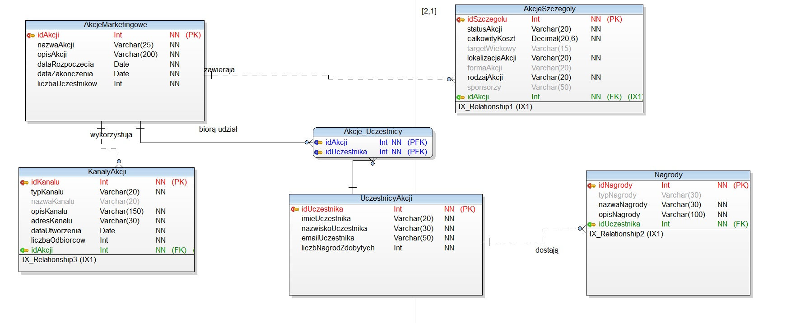

# Park Rozrywki

## Cel Projektu:
Celem projektu jest stworzenie kompletnego systemu analizy danych, obejmującego bazy danych, hurtownię danych (ETL), model OLAP oraz interaktywne dashboardy w środowisku Power BI Desktop.

Projekt realizowany jest w zespołach pięcioosobowych i składa się z 4 etapów.

## Organizacja Pracy:

### Ukończone: 
#### ETAP I (26.02.2024 - 11.03.2024)
- **Cel:** Opracowanie dwóch relacyjnych baz danych w środowisku MS SQL Server.
- **Narzędzia:** Toad Data Modeler 7.2, SQL Server Management Studio 19
  
BAZA I

BAZA II

### W trakcie: 
#### ETAP II (11.03.2024 - 15.04.2024)
- **Cel:** Opracowanie dwóch relacyjnych baz danych w środowisku MS SQL Server.

#### ETAP III (15.04.2024 - 13.05.2024)

#### ETAP IV (13.05.2024 - 03.06.2024)

## Planowana Data Ukończenia Projektu: [Wprowadź planowaną datę ukończenia projektu]
