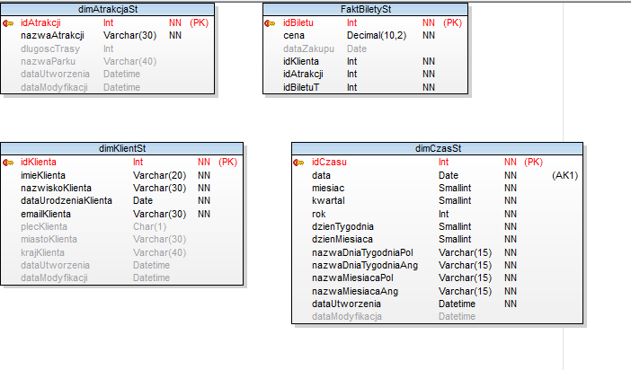

# Park Rozrywki

## Cel Projektu:
Celem projektu jest stworzenie kompletnego systemu analizy danych, obejmującego bazy danych, hurtownię danych (ETL), model OLAP oraz interaktywne dashboardy w środowisku Power BI Desktop.

Projekt jest realizowany w zespołach pięcioosobowych na potrzeby przedmiotu Analityczne Bazy Danych (ABD).

## Narzędzia:

- **SQL Server Management Studio 19**
- **Toad Data Modeler 7.2**
- **Visual Studio 2019**

Projekt realizowany jest w zespołach pięcioosobowych i składa się z 4 etapów.

## ETAP I (26.02.2024 - 11.03.2024)
**Cel:** Opracowanie dwóch relacyjnych baz danych w środowisku MS SQL Server.

BAZA I

BAZA II

## ETAP II (11.03.2024 - 15.04.2024)
**Cel:** Celem tego etapu projektu jest implementacja hurtowni danych przy użyciu technologii ETL (Microsoft SQL Server Integration Services - SSIS) oraz opartej na modelu konstelacji gwiazdy. Celem jest stworzenie dwóch tabel faktów oraz pięciu tabel wymiarów.

**Projekt gwiazdy**
  
Pierwsza faza polegała na zaprojektowaniu modelu gwaizdy dla każdej z dwóch wcześniej stworzonych baz relacyjnych.
  
**ODS**
  
Następnie wcześniej stworzony model danych został poddany kolejnej modyfikacji, celem utworzenia warstwy pośredniej między systemem OLTP a hurtownią danych. Po zdefiniowaniu struktury ODS, skonfigurowano procesy w środowisku Visual Studio, umożliwiające pobieranie danych z baz źródłowych do ODS. Opracowano również mechanizm inkrementalny, który pozwala na przesyłanie do ODS tylko tych rekordów z baz źródłowych, które uległy zmianie.

BAZA I
1. Modelowanie i implementacja schematu struktur hurtowni danych - stoworzenie modelu konstelacji gwiazdy
   
   
   
2. Modelowanie schematu struktur ODS
   
   

BAZA II
1. Konstelacja gwiazdy dla bazy drugiej
   
2. ODS dla bazy drugiej 
   

## ETAP III (15.04.2024 - 13.05.2024)
- **Cel:** Projekt i implementacja modelu OLAP w formie bazy tabelarycznej (MS SSAS) wraz z
zasilaniem

Etap 3 polegał na zaprojektowaniu i implementacji modelu OLAP w technologii SSAS Tabular na podstawie wcześniej przygotowanej hurtowni danych. Zbudowano model tabelaryczny obejmujący fakty „Bilety” i „AkcjaMarketingowa”, utworzono relacje między tabelami oraz dodano kluczowe miary analityczne, takie jak całkowity przychód, średni koszt biletu, liczba wejść, liczba unikalnych klientów czy koszty kampanii. Wprowadzono również perspektywy tematyczne (np. Marketing, Uczestnik) w celu uproszczenia analiz. Na podstawie modelu przygotowano raporty w Excelu w formie tabel przestawnych. Podjęto także próbę wdrożenia mechanizmu codziennego odświeżania danych, jednak ze względu na ograniczenia techniczne nie został on w pełni uruchomiony.

## ETAP IV (13.05.2024 - 03.06.2024)
- **Cel:** Dashboardy w narzędziu analizy Microsoft Power BI Desktop.

W tym etapie przygotowano interaktywne dashboardy w Power BI na podstawie modelu SSAS Tabular. Opracowane raporty prezentują analizę sprzedaży biletów, koszty działań marketingowych, lokalizacje wydarzeń oraz dane statystyczne dotyczące uczestników.

1. Koszt netto akcji marketingowych w podziale na lata
   
   Wykres przedstawia całkowity koszt netto akcji marketingowych w ujęciu rocznym. Widoczny jest istotny wzrost kosztów w 2023 roku – ponad dwukrotnie wyższy niż w pozostałych latach. Analiza pozwala zidentyfikować rok o najwyższym obciążeniu budżetowym oraz stanowi punkt wyjścia do oceny efektywności wydatków marketingowych w relacji do osiągniętych rezultatów.
2. Koszt netto akcji marketingowych w 2023 roku w podziale na miesiące
    
   Wykres pokazuje miesięczne rozłożenie kosztów marketingowych w roku 2023. Największy wzrost wydatków widoczny jest w październiku, co wskazuje na intensywną kampanię sezonową. Analiza sezonowości pozwala określić okresy największego ryzyka budżetowego oraz ocenić, czy zwiększone nakłady były uzasadnione poziomem aktywności uczestników.
3. Liczba uczestników akcji marketingowych (miesięcznie, kwartalnie i rocznie)
   
   Dashboard prezentuje liczbę uczestników w różnych przekrojach czasowych. Najwięcej uczestników odnotowano w IV kwartale, natomiast analiza roczna pokazuje spadek liczby uczestników w kolejnych latach. W połączeniu z analizą kosztów umożliwia to ocenę efektywności kampanii oraz identyfikację potencjalnego spadku skuteczności działań marketingowych.
4. Lokalizacja akcji marketingowych: koszt vs liczba uczestników
   

## Najważniejsze wnioski z analizy akcji marketingowych

- Rok 2023 był najbardziej kosztowny – wydatki marketingowe były ponad dwukrotnie wyższe niż w pozostałych latach.
- Najwyższe koszty odnotowano w październiku, co wynikało z intensywnych kampanii sezonowych.
- Liczba uczestników spada z roku na rok, mimo wzrostu kosztów, co może wskazywać na malejącą efektywność strategii marketingowej.
- Największa aktywność uczestników przypada na IV kwartał, szczególnie luty i grudzień.
- Najbardziej efektywną kosztowo lokalizacją jest Park przy lesie (korzystniejszy koszt na uczestnika).
- Park Rozrywki generuje wysokie koszty jednostkowe, co wymaga dalszej optymalizacji działań.
- Akcje organizowane przy Karuzelach charakteryzują się niską rentownością.

---

### Uwaga dotycząca danych

Dane wykorzystane w projekcie zostały stworzone na potrzeby realizacji zadania akademickiego i wprowadzone manualnie przez członków zespołu projektowego. W związku z tym mogą występować niespójności lub zależności nieodzwierciedlające realnych warunków biznesowych.

# Theme Park Data Analytics System

## Project Objective

The objective of this project was to design and implement a complete data analytics system, including relational databases, a data warehouse (ETL processes), an OLAP model, and interactive dashboards developed in Microsoft Power BI Desktop.

The project was carried out in five-person teams as part of the Analytical Databases (ABD) course.

## Tools

- SQL Server Management Studio 19  
- Toad Data Modeler 7.2  
- Visual Studio 2019  

The project was completed in four stages.

---

## STAGE I (26.02.2024 – 11.03.2024)

**Objective:** Design and implementation of two relational databases in MS SQL Server.

### DATABASE I

### DATABASE II

---

## STAGE II (11.03.2024 – 15.04.2024)

**Objective:** Implementation of a data warehouse using ETL technology (Microsoft SQL Server Integration Services – SSIS) based on a constellation schema model. The goal was to create two fact tables and five dimension tables.

### Star Schema Design

The first phase involved designing star schemas for both previously created relational databases.

### Operational Data Store (ODS)

The existing data model was extended to create an intermediate layer between the OLTP systems and the data warehouse. After defining the ODS structure, ETL processes were configured in Visual Studio to extract data from source databases into the ODS layer.

An incremental loading mechanism was implemented to transfer only modified records from the source systems to the ODS.

### DATABASE I

1. Modeling and implementation of the data warehouse structure – constellation schema  

   

2. ODS schema modeling  

   

### DATABASE II

1. Constellation schema for the second database  

   

2. ODS schema for the second database  

   

---

## STAGE III (15.04.2024 – 13.05.2024)

**Objective:** Design and implementation of an OLAP model in tabular form (MS SSAS) with data processing.

This stage focused on designing and implementing an OLAP model using SSAS Tabular based on the previously developed data warehouse.

The tabular model included fact tables such as “Tickets” and “MarketingCampaign”. Relationships between tables were established, and key analytical measures were created, including:

- Total revenue  
- Average ticket price  
- Number of entries  
- Number of unique customers  
- Campaign costs  

Subject-oriented perspectives (e.g., Marketing, Participant) were introduced to simplify analysis. Based on the model, pivot table reports were prepared in Microsoft Excel.

An attempt was made to implement a daily data refresh mechanism; however, due to technical limitations, it was not fully deployed.

---

## STAGE IV (13.05.2024 – 03.06.2024)

**Objective:** Development of interactive dashboards in Microsoft Power BI Desktop.

In this stage, interactive dashboards were created in Power BI based on the SSAS Tabular model. The reports present analyses of ticket sales, marketing costs, event locations, and participant statistics.

### 1. Net Marketing Campaign Costs by Year

The chart presents the total annual net marketing costs. A significant increase is visible in 2023, where expenses were more than twice as high as in other years. The analysis identifies the year with the highest budget burden and serves as a basis for evaluating marketing efficiency relative to achieved results.

### 2. Net Marketing Campaign Costs in 2023 by Month

The chart illustrates the monthly distribution of marketing expenses in 2023. The highest increase occurred in October, indicating an intensive seasonal campaign. Seasonal analysis helps identify periods of increased budget risk and assess whether higher expenditures were justified by participant engagement.

### 3. Number of Marketing Campaign Participants (Monthly, Quarterly, Yearly)

The dashboard presents participant numbers across different time perspectives. The highest participation was recorded in Q4. However, annual analysis shows a declining number of participants over consecutive years. Combined with cost analysis, this enables evaluation of campaign effectiveness and identification of potential decreases in marketing performance.

### 4. Marketing Campaign Location: Cost vs. Number of Participants

---

## Key Insights from Marketing Campaign Analysis

- 2023 was the most expensive year, with marketing expenditures more than twice as high as in previous years.  
- The highest costs were recorded in October due to intensive seasonal campaigns.  
- The number of participants decreases year by year despite rising costs, indicating declining marketing effectiveness.  
- The highest participant activity occurs in Q4, particularly in February and December.  
- The most cost-efficient location is “Park by the Forest” (lower cost per participant).  
- The main Theme Park location generates high unit costs and requires further optimization.  
- Campaigns organized near the Carousel area show low profitability.

---

## Data Disclaimer

The data used in this project was created for academic purposes and manually entered by the project team members. Therefore, inconsistencies or dependencies that do not fully reflect real business conditions may be present.

   
   
   
   
   

